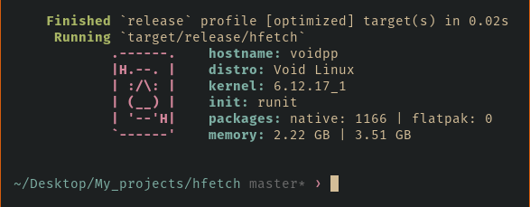

## hfetch

Minimalistic and blazing-fast fetch for Linux

## Features ✨:
- Blazing fast: Written in Rust with perfomance optimizations
- No dependencies: No bloat, just pure speed
- Clean output: Simple and elegant ASCII art with system info
- Resource efficient: Use minimal system resources
- Cross-distro: Works on most Linux distro

📸 

## Building 🚀:
1. Using Cargo:
```bash
cargo install --git https://github.com/Hkmori15/hfetch
```

2. Manual building:
```bash
git clone https://github.com/Hkmori15/hfetch.git
cd/z hfetch
cargo build --release
sudo install -Dm755 target/release/hfetch /usr/local/bin/hfetch
```
## Usage 🖥:
Just run:
```bash
hfetch
```
## Acknowledgements 🙏:
Inspired by [fastfetch](https://github.com/fastfetch-cli/fastfetch) and [pfetch-rs](https://github.com/Gobidev/pfetch-rs)
